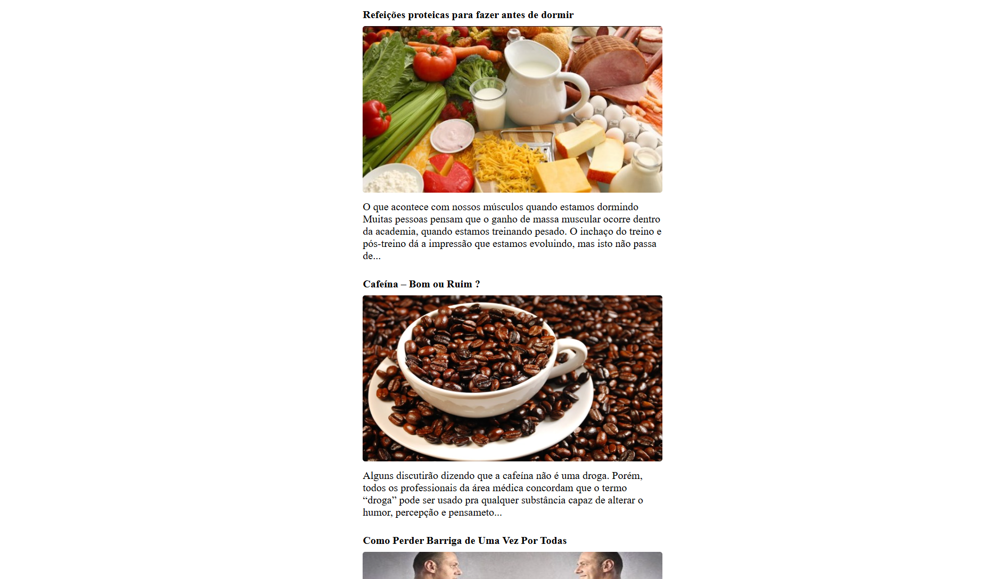
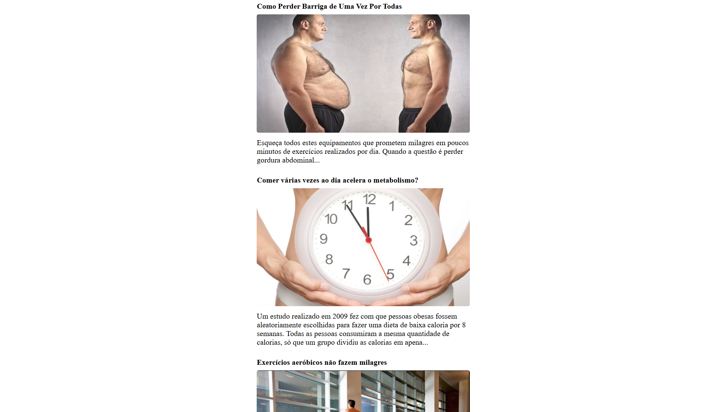

# NutriApp - Consumidor de API

Este é um projeto web simples e responsivo desenvolvido em JavaScript Vanilla. Ele consome uma API externa de posts sobre nutrição, processa os dados retornados e os renderiza dinamicamente na tela do usuário manipulando o DOM.

---

## 📸 Demonstração

Abaixo você pode conferir o visual e o funcionamento da aplicação:





---

## 📁 Estrutura do Projeto

O repositório está organizado com a seguinte estrutura de arquivos:

```text
├── api1.png
├── api2.png
├── index.html
├── script.js
└── style.css

```

---

## 🛠️ Tecnologias Utilizadas

* **HTML5:** Estruturação semântica da página (contendo a lista base para os posts).
* **CSS3:** Estilização e layout dos elementos (gerenciado via `style.css`).
* **JavaScript (ES6):** * **Fetch API:** Para realizar as requisições assíncronas de forma nativa.
* **Promises (`.then` / `.catch`):** Para o tratamento da resposta e controle de erros.
* **Método `.map()`:** Para percorrer os dados recebidos e criar a estrutura HTML de cada post dinamicamente.


---

## ⚙️ Como Funciona o Fluxo de Dados?

1. **Requisição:** A função `nutriApp()` é disparada assim que o script é carregado, fazendo um chamado `GET` para a URL `https://sujeitoprogramador.com/rn-api/?api=posts`.
2. **Tratamento:** O formato da resposta é convertido para JSON.
3. **Manipulação do DOM:** Para cada item do array de posts recebido, o JavaScript cria:
* Um elemento `<li>` (container do post).
* Um elemento `<strong>` (para o título).
* Um elemento `` (para a imagem de capa).
* Um elemento `<a>` (para o subtítulo/descrição).


4. **Injeção:** Todos esses elementos são aninhados e injetados diretamente dentro da `<ul>` identificada com o id `#app` no HTML.

---

## 🚀 Como Executar o Projeto

1. Certifique-se de ter todos os arquivos listados na [Estrutura do Projeto](https://www.google.com/search?q=%23-estrutura-do-projeto) no mesmo diretório.
2. Abra o arquivo `index.html` diretamente em qualquer navegador web de sua preferência (ou utilize a extensão *Live Server* no VS Code).
3. Certifique-se de estar conectado à internet para que a API consiga carregar os posts e as imagens externas com sucesso.

---

## 👨‍💻 Autor
Desenvolvido com por Lucas Melo ☕.